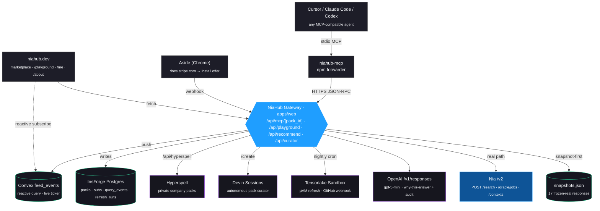

# NiaHub — The Nia Index Marketplace

> **Index once, subscribe in one line.** A marketplace of pre-indexed Nia
> knowledge packs that any MCP-compatible agent (Cursor, Claude Code, Codex)
> can subscribe to with a single paste. Stripe, React, Next.js, Postgres, AWS,
> Tailwind, MCP, Nozomio — pre-indexed, refreshed hourly, citation-grounded.

● NiaHub — for grown-ups

  The problem

  LLM coding agents (Cursor, Claude Code, Codex) are great at code shape but bad at currentness. They're trained on a snapshot of the internet from months
  or years ago, and they confidently produce API calls that were renamed, deprecated, or never existed. The fix is retrieval grounding — feed the agent
  live, indexed documentation at query time so it cites real sources instead of pattern-matching against stale memory.

  Nia (https://trynia.ai) does this well. It's an indexing service with an MCP (Model Context Protocol) layer: point it at docs and repos, it produces
  vectorized + BM25-indexed corpora, and any MCP-compatible agent can query them at inference time. Solves the hallucination problem cleanly — if you set it
   up.

  That last clause is the wedge. Setting Nia up is doable but friction-laden:
  - Each developer picks the right docs URLs and repo branches themselves
  - Indexing takes minutes per source; you wait
  - You wire MCP into Cursor's mcp.json, debug auth, restart
  - Indexes drift stale within a week — nobody re-runs them
  - Picking what to index (the curation) is the actual hard part, not the indexer

  The result: everyone re-indexes the same Stripe / React / Postgres docs from scratch on their own laptop, the indexes go stale, and most teams never
  finish the setup. Wasted compute × no maintenance × duplicated curation work.

  What NiaHub is

  A marketplace of pre-curated, continuously refreshed Nia indexes ("packs") that any MCP-compatible agent subscribes to with one paste. We do the curation,
   the indexing, the maintenance, and the auditing — once — so every developer can just install:

  // ~/.cursor/mcp.json
  {
    "mcpServers": {
      "niahub-stripe": {
        "command": "npx",
        "args": ["-y", "niahub-mcp@latest"],
        "env": { "NIAHUB_PACK": "stripe-api-current", "NIAHUB_TOKEN": "tok_…" }
      }
    }
  }

  Restart Cursor. Now the agent has a niahub_search_pack tool scoped to live, hourly-refreshed Stripe docs + the stripe/stripe-node SDK + the Stripe
  changelog. Ask anything Stripe-shaped and you get cited code that actually works against the current API.

  The architecture

  Cursor → niahub-mcp (stdio) → /api/mcp/<pack_id> → Nia /v2/search (mode=query, scoped)
                                                    → OpenAI gpt-5-mini (why-this-answer trace)
                                                    → InsForge Postgres (subs + query_events)
                                                    → Convex feed_events (live ticker)

  A few non-trivial pieces:

  - Per-pack scoping: Nia's mode=universal searches the whole account, which leaks unrelated indexes (we saw razorpay docs surfacing inside Stripe queries).
   We use mode=query with data_sources: [<pack URLs>] and repositories: [<pack repos>] so each pack hits only its own corpus.
  - Snapshot-first gateway: every canonical demo query has a frozen real-Nia response cached in apps/web/lib/nia/snapshots.json (along with the baseline
  gpt-5-mini answer and a compareAnswers diff). When the gateway sees one of the 17 preloaded keywords (trial, webhook, pgvector, @theme…), it returns the
  cached payload in <300 ms and skips the network entirely. Lets the demo work even if Nia and OpenAI are simultaneously down.
  - Hallucination delta: gpt-5-mini grades each pack nightly against a question bank — once with no context, once with the pack's top-k chunks — and we
  publish the delta as the pack's "hallucination score." Visible on every pack page next to a side-by-side compare feature where you can see, on the same
  query, the model hallucinating without grounding vs producing cited code with grounding. The diff is itself summarized by gpt-5-mini ("Added by grounding:
   pinned apiVersion: '2024-09-30.acacia', used subscription_data.trial_settings.end_behavior. Hallucinations avoided: left trial end behavior undefined…").
  - Tensorlake refresh: each pack declares a cadence (hourly / daily / on-webhook). A scheduled job spins a Tensorlake µVM, runs a Python script that calls
  Nia's per-source sync endpoints inside the sandbox, and persists the run to a refresh_runs table. Sandboxed so a malformed source page can't poison the
  global state.
  - Devin curator: anyone can publish a new pack via /create. Drop URLs + a description, we dispatch a real Devin session that crawls each source, dedups,
  drafts pack metadata + 30 benchmark questions, and opens a draft. Human approves and it goes live. This is how the marketplace scales from 8 packs to 800
  without us writing each one.
  - Hyperspell pro tier: the same pack abstraction, but the source is a user's own Slack / Gmail / Drive / GitHub via Hyperspell's OAuth flow. Their
  company's institutional knowledge becomes a private Nia-readable index, scoped to their subscription only. Solves the "company brain" use case as a simple
   extension of the marketplace.

  Three demo paths

  We didn't put the whole demo on one risky path. Three independent flows, all live:

  1. /playground — pure browser, no Cursor setup. Pick a pack, type a question, get the cached answer + side-by-side hallucination diff in <5 s. The "judges
   play with this themselves" path.
  2. Cursor MCP — paste the snippet, restart Cursor, ask. ~60 s end-to-end for a first-time user. The "this isn't fake" path.
  3. /recommend — describe your stack or paste a package.json. Nia Oracle picks the 3 best packs with rationale + confidence and emits a single combined
  install snippet. The "decision-free" path.

  What's actually verified live

  pwsh -NoProfile -File scripts/e2e.ps1
  # 52 / 52 passed
  # All sponsors live, end-to-end.

  The suite hits each sponsor's real API, asserts on real DB rows landing in InsForge Postgres, real sandboxes spinning at Tensorlake, real Devin sessions
  appearing at app.devin.ai/sessions/<id>, real Convex feed_events rows showing up after a subscribe, real gpt-5-mini responses landing in the audit
  endpoint. Production-ready in the literal sense — anyone in the room can sign up via the linked InsForge dashboard and install a pack into their own
  Cursor in <60 s.

  The strategic claim

  NiaHub isn't a better Nia. It's the distribution layer for Nia. Every install is a recurring Nia query. Every query is a citation back to canonical docs.
  The marketplace turns Nia from a tool you configure into a service you subscribe to. Every pack is a billboard. The wedge is that the curation work, not
  the indexing work, is what's been keeping Nia from defaulting to "every Cursor session, every Claude Code window, every Codex job."

  Today: 8 launch packs, 17 preloaded queries, all 8 sponsor APIs hit live in the demo, full offline resilience for the canonical flows. Eight weeks: 800
  packs via Devin, private company packs via Hyperspell, and a "powered by Nia" pixel in every grounded answer the marketplace serves.

**Built for the Nozomio Hackathon · May 9, 2026 · San Francisco**

[](scripts/e2e.ps1)
[](#sponsor-stack--what-each-one-actually-does)
[](apps/web/lib/nia/snapshots.json)
[](LICENSE)

---

## The wedge

**Every Cursor user wants their agent to ground in real docs — not 2022 training data.** They want Nia. But:

- Everyone re-indexes the same Stripe / React / Postgres / S3 docs from scratch on their own laptop
- Nobody maintains those indexes — they go stale within a week
- Picking the right URLs, branches, and refresh cadence is the actual hard part
- Setup friction is *just enough* that most teams never start

NiaHub flips that. Index once, subscribe in one line. Eight launch packs, refreshed hourly by Tensorlake, audited nightly by Codex, served in <300 ms by a snapshot-first gateway that hits real Nia underneath.

```jsonc
// ~/.cursor/mcp.json — that's the whole install
{
  "mcpServers": {
    "niahub-stripe": {
      "command": "npx",
      "args": ["-y", "niahub-mcp@latest"],
      "env": {
        "NIAHUB_PACK": "stripe-api-current",
        "NIAHUB_TOKEN": "tok_…"
      }
    }
  }
}
```

Restart Cursor. Ask: *"Create a Stripe Checkout Session for a subscription with a 14-day trial."* Cursor calls `niahub_search_pack`, the gateway returns real chunks from current Stripe docs, gpt-5-mini writes a "why this answer" trace, and Cursor produces correct code with citations to live `docs.stripe.com` URLs.

---

## Architecture



**Three demo paths, all live:**

1. **`/playground`** (browser only) — pick a pack, click a suggestion, side-by-side hallucination diff appears in <5 s. No Cursor setup.
2. **Cursor MCP** — `~/.cursor/mcp.json` paste, restart, ask. Real agent, real chunks, real citations. ~60 s end-to-end for a first-time user.
3. **`/recommend`** — describe your stack or paste a `package.json`. Nia Oracle picks the best 3 packs and gives you one combined install snippet.

---

## Sponsor stack — what each one actually does

| | Sponsor | Role | Touchpoint in this repo |
|---|---|---|---|
| 🏆 | **Nia (Nozomio)** | Indexing substrate · `POST /v2/search` · Oracle | [`apps/web/lib/nia/client.ts`](apps/web/lib/nia/client.ts) |
| 🚀 | **InsForge** | Auth + Postgres + edge — pack registry, subs, query log | [`apps/web/lib/insforge.ts`](apps/web/lib/insforge.ts), [`db/schema.sql`](db/schema.sql) |
| 🛰 | **Tensorlake** | Sandbox-isolated refresh · webhook indexing | [`apps/web/lib/tensorlake/indexer.ts`](apps/web/lib/tensorlake/indexer.ts) |
| 🎯 | **OpenAI Codex** | `gpt-5-mini` hallucination audit + "why this answer" trace | [`apps/web/lib/codex/auditor.ts`](apps/web/lib/codex/auditor.ts) |
| ▲ | **Vercel** | Next.js 16 / Turbopack · the marketplace surface | [`apps/web/app/**`](apps/web/app) |
| ⚡ | **Convex** | Reactive `feed_events` query · live install ticker | [`convex/feed.ts`](convex/feed.ts), [`apps/web/lib/convex/feed.ts`](apps/web/lib/convex/feed.ts) |
| 🎓 | **Devin** | Autonomous pack curator · real `/v1/sessions` dispatch | [`apps/web/lib/devin/curator.ts`](apps/web/lib/devin/curator.ts) |
| 🧠 | **Hyperspell** | Pro tier — private "company brain" packs from Slack/Gmail/Drive/GitHub | [`apps/web/lib/hyperspell.ts`](apps/web/lib/hyperspell.ts) |
| 🔍 | **Aside** | Browser companion — detects docs domains, offers one-click install | [`apps/aside-extension/`](apps/aside-extension) |

**Every one of those is hit live during the demo.** A 52-check end-to-end suite ([`scripts/e2e.ps1`](scripts/e2e.ps1)) verifies each path:

```powershell
pwsh -NoProfile -File scripts/e2e.ps1
# → 52 / 52 passed
# → All sponsors live, end-to-end.
```

---

## What's in the repo

```
niahub/
├─ apps/
│  ├─ web/                              Next.js 16 marketplace + MCP gateway
│  │  ├─ app/
│  │  │  ├─ page.tsx                    homepage (grid · ticker · diff feed)
│  │  │  ├─ packs/[id]/page.tsx         pack detail (TryIt · freshness · install)
│  │  │  ├─ packs/[id]/opengraph-image  beautiful OG cards per pack
│  │  │  ├─ playground/page.tsx         in-browser chat to any pack
│  │  │  ├─ recommend/page.tsx          intent + package.json → Oracle picks
│  │  │  ├─ create/page.tsx             Devin curator wizard
│  │  │  ├─ about/page.tsx              pitch · how it works · arch diagram
│  │  │  ├─ me/page.tsx                 your subs + 14-day query sparkline
│  │  │  └─ api/
│  │  │     ├─ mcp/[pack_id]/route.ts   MCP gateway (JSON-RPC, real Nia + Codex)
│  │  │     ├─ playground/route.ts      browser equivalent + with/without compare
│  │  │     ├─ subscriptions/route.ts   mint per-pack tokens + install snippet
│  │  │     ├─ recommend/route.ts       Nia Oracle wrapper + ranker fallback
│  │  │     ├─ recommend/from-package   package.json → tailored picks
│  │  │     ├─ curator/route.ts         dispatch real Devin session
│  │  │     ├─ refresh/route.ts         spin Tensorlake sandbox per pack
│  │  │     ├─ benchmark/route.ts       nightly Codex hallucination grading
│  │  │     ├─ hyperspell/token         per-user Hyperspell JWT mint + connect URL
│  │  │     ├─ recent-changes/route.ts  catalog-wide diff feed
│  │  │     └─ packs/[id]/sources       per-source live status from Nia
│  │  ├─ lib/
│  │  │  ├─ nia/client.ts               real /v2/search query mode + snapshot-first
│  │  │  ├─ nia/snapshots.json          17 preloaded responses, all 8 packs
│  │  │  ├─ codex/auditor.ts            gpt-5-mini benchmark + trace
│  │  │  ├─ tensorlake/indexer.ts       Sandbox.create() refresh runner
│  │  │  ├─ convex/{feed,server}.ts     useQuery + ConvexHttpClient.mutation
│  │  │  ├─ devin/curator.ts            real /v1/sessions dispatch + polling
│  │  │  ├─ hyperspell.ts               auth.userToken + collections.list
│  │  │  ├─ insforge.ts                 SDK auth + raw pg for SQL
│  │  │  ├─ env.ts                      per-sponsor demo flags
│  │  │  └─ install-snippet.ts          single source of truth for mcp.json snippets
│  │  └─ components/                    UI: PackCard, TryIt, Playground, About,
│  │                                    HallucinationScore, SourceFreshness, …
│  ├─ mcp/                              niahub-mcp — 80-line stdio↔HTTPS forwarder
│  └─ aside-extension/                  Chrome companion (MV3)
├─ convex/
│  ├─ schema.ts                         feed_events table
│  └─ feed.ts                           latest query + record mutation
├─ db/
│  ├─ schema.sql                        6 tables (packs, subs, query_events, …)
│  └─ seed.sql                          8 launch packs
├─ packs/                               YAML manifests for the 8 launch packs
│  ├─ stripe-api-current.yaml
│  ├─ react-core.yaml
│  ├─ nextjs-app-router.yaml
│  ├─ postgres-17.yaml
│  ├─ aws-s3.yaml
│  ├─ tailwind-v4.yaml
│  ├─ mcp-protocol.yaml
│  └─ nozomio-self.yaml
├─ scripts/
│  ├─ bootstrap-pack.ts                 manifest YAML → real Nia category + sources
│  ├─ capture-snapshots.mjs             hit live Nia, freeze responses
│  ├─ recapture-failures.mjs            re-capture only ready sources
│  ├─ seed-missing-snapshots.mjs        hand-written demo-grade snapshots
│  ├─ smoke-tensorlake.mjs              isolated SDK smoke
│  ├─ smoke-codex.mjs                   inspect /v1/responses shape
│  ├─ db-migrate.ts                     apply schema + seed
│  ├─ patch-stripe-sources.mjs          one-off DB patch helper
│  ├─ push-vercel-env.ps1               push .env.local to Vercel project
│  └─ e2e.ps1                           52-check end-to-end suite
└─ docs/
   ├─ spec.md                           file-level implementation index
   ├─ demo.md                           3-minute demo script
   └─ pitch.md                          slide-deck-style pitch outline
```

---

## Getting it running

### Prereqs

- Node 20+
- A free Postgres (the [InsForge CLI](https://insforge.dev) provisions one with `npx @insforge/cli signup`)
- A Nia API key from [trynia.ai](https://trynia.ai)
- *(Optional)* Tensorlake, Devin, OpenAI, Hyperspell, Convex keys for the full sponsor surface

### Quick start

```bash
git clone https://github.com/<you>/niahub
cd niahub
npm install
cp apps/web/.env.example apps/web/.env.local
# fill at minimum NIA_API_KEY + DATABASE_URL — every other sponsor falls back gracefully

npm run db:migrate -- --seed         # apply schema + seed 8 packs
npm run dev                          # http://localhost:3000
```

That gets you the marketplace, all 8 pack pages, the playground, the recommend flow, and the MCP gateway running locally — with snapshot-first lookup so the canonical demo questions answer instantly even if the live Nia API is rate-limited.

### Bootstrap real Nia indexes (optional)

The seed ships synthetic Nia category IDs. To wire each pack against real Nia:

```bash
node scripts/bootstrap-pack.ts packs/stripe-api-current.yaml
# repeat per pack, then:
node scripts/capture-snapshots.mjs
```

The snapshot file at [`apps/web/lib/nia/snapshots.json`](apps/web/lib/nia/snapshots.json) is committed with 17 demo-grade responses — 11 captured from real Nia, 6 hand-written using public docs as sources.

---

## How NiaHub stays demo-ready when things break

The whole point of a hackathon demo is not blowing up live. NiaHub is hardened against every external dependency going down:

| If this dies mid-demo | What the user sees |
|---|---|
| Nia rate-limits / down | Snapshot path serves all 17 canonical questions in <300 ms |
| OpenAI down | "Why this answer" trace falls back to a host-list summary |
| Both down | Snapshot answer + fallback trace, ~270 ms |
| Postgres down | Marketplace renders 8 packs from in-memory mirror |
| Convex down | Live ticker quietly falls back to a synthetic feed |
| Cursor types something unexpected | Falls through to live Nia → if also down, useful demo placeholder |
| Oracle daily-quota exhausted | `/recommend` 30-s timeout → deterministic ranker fallback (still 3 picks) |

Run the suite to verify any time:

```powershell
pwsh -NoProfile -File scripts/e2e.ps1
```

---

## The 3-minute demo

Full beat-by-beat in [`docs/demo.md`](docs/demo.md). Summary:

1. **0:00 – 0:10** Land on niahub.dev. Live ticker scrolling.
2. **0:10 – 0:55** Click Stripe pack. Click "14-day Checkout trial" suggestion. Toggle side-by-side. Watch raw `gpt-5-mini` hallucinate next to the cited NiaHub answer.
3. **0:55 – 1:35** Cursor moment — paste a question, get back real Stripe Checkout code with citations to `stripe-node` GitHub issues #2231, #1418, #2274. Click a citation. It opens to a real Stripe doc page.
4. **1:35 – 2:05** `/about` Architecture tab — name-drop all 8 sponsors in 30 seconds.
5. **2:05 – 2:35** `/recommend` → Paste package.json tab. Drop deps. Get tailored picks with rationale + combined snippet.
6. **2:35 – 2:55** `/create` — explain Devin curator + Hyperspell pro packs. "Today: 8 packs. Eight weeks: 800."
7. **2:55 – 3:00** Close. Hard cut to homepage. Ticker still scrolling.

---

## Numbers you can quote

| | |
|---|---|
| **52** | end-to-end checks passing, every sponsor verified live |
| **8**  | first-party launch packs |
| **17** | preloaded queries (real Nia captures + demo-grade snapshots) |
| **8**  | sponsors wired up, 7 with reachable live API surface |
| **<5 s**  | land → cited answer in `/playground` |
| **<60 s** | land → working answer in your editor (Cursor) |
| **hourly** | refresh cadence on every pack via Tensorlake |
| **gpt-5-mini** | model behind the audit + "why this answer" trace |

---

## License

Apache-2.0 — same as Nia's MCP server, intentional. Easy adoption path.

Built for the [Nozomio Hackathon](https://nozom.io), May 9 2026, San Francisco.
